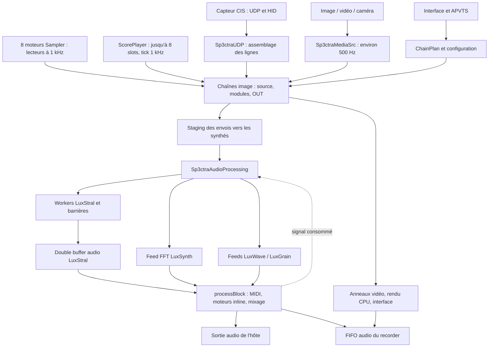

# Audit des performances SP3CTRA — 6 septembre 2026

## Conclusion et portée

**Le problème ne se limite pas à `processBlock()`. Le producteur LuxStral, les lecteurs d'images et le rendu vidéo peuvent saturer la machine pendant qu'un callback audio très court continue de rejouer des données anciennes.** Les logs locaux montrent effectivement ce cas.

Les priorités sont : supprimer les attentes actives, réduire le travail systématique de LuxStral, corriger la taille des allocations Sampler, et rendre fiables les échanges entre threads. Optimiser seulement la FFT ou augmenter le buffer laisserait plusieurs causes intactes.

Analyse de l'arbre de travail local, incluant ses modifications non commitées : commit de référence `d37ffdc`, fichier `vst/VERSION` lu à `1.4.599`. Les commentaires et le README décrivent parfois des architectures antérieures ; les constats ci-dessous suivent les appels effectifs. Aucun code du projet ni réglage utilisateur n'a été modifié. Seul ce rapport est ajouté au dépôt.

Éléments exploités : sources C/C++/Objective-C++, JUCE présent dans `build/_deps/juce-src`, configuration de compilation, journal `~/Library/Logs/Sp3ctra/Sp3ctra.log`, inventaire local d'Instruments, et un microbenchmark hors dépôt de la fonction d'enveloppe originale. La machine accessible annonce **Apple M2 Max, 12 cœurs physiques, 32 Gio, macOS 26.5.1, arm64**. Le modèle commercial exact, le DAW et le scénario de reproduction utilisateur restent à confirmer.

Il n'y a pas eu de capture Instruments de la session défaillante, ni de mesure acoustique des craquements. Les logs ne portent pas assez d'identifiants pour certifier leur correspondance exacte avec le binaire construit à partir de cet arbre. Les gains proposés sont des estimations à valider, pas des résultats de corrections déjà appliquées.

## 1. Architecture actuelle



### Moteur audio et producteurs

- **JUCE / `processBlock()`**, [PluginProcessor.cpp](../vst/source/PluginProcessor.cpp), à partir de la ligne 3429 : effacement de la sortie, MIDI et HID, LFO/mappings, transport des séquenceurs, acquisition, consommation de LuxStral, rendu inline de LuxSynth/LuxWave/LuxGrain, préécoute Score, volumes, enregistrement audio, sortie MIDI TAP et vumètres. Le chemin n'effectue pas la FFT d'analyse LuxSynth.
- **LuxStral**, [multithreading.c](../vst/source/threading/multithreading.c), `audioProcessingThread()` ligne 2466 : attend la consommation du bloc précédent ; mélange les envois ; exécute aussi les feeds des trois autres moteurs ; lance le pool LuxStral ; publie un nouveau bloc audio. C'est un chemin soumis à une échéance audio, même si plusieurs commentaires le qualifient de « non-RT ».
- **Pool LuxStral**, [synth_luxstral_threading.c](../vst/source/synthesis/luxstral/synth_luxstral_threading.c) : partition statique des notes entre workers persistants, deux barrières par bloc, réduction des sorties. Six workers dans les logs examinés ; huit dans la configuration C par défaut. Les barrières macOS utilisent mutex et condition variables.
- **LuxSynth** : analyse FFT de la ligne mixée dans `luxsynth_feed_tick()` sur le producteur, puis banque additive harmonique sur le callback ; au maximum **8 voix × 128 oscillateurs**. L'option d'affichage/feed « 256 harmoniques » est plafonnée à 128 lors de la publication moteur.
- **LuxWave** : lecture interpolée d'une ligne comme wavetable, jusqu'à **8 voix**, ADSR, filtre passe-bas, crossfade de tables ; rendu dans le callback.
- **LuxGrain** : images regroupées en bandes sur le producteur ; lancement et rendu des grains dans le callback ; **192 bandes, 768 grains, historique de 512 lignes** au maximum.

### Traitement des images

Les modules Pitch, Mask, Centro, Harmo, EQ, Drive, Echo, Reverb, Diff, etc. opèrent principalement **sur les lignes d'image**, avant la conversion en son. Echo/Reverb ne doivent donc pas être comptés comme des réverbérations audio par sample dans `processBlock()`.

Le routage est compilé en `ChainPlan`, jusqu'à 8 chaînes. `image_chain.c`, `image_pipeline*.c`, `multithreading.c` exécutent les segments et publient les envois. La source physique est assemblée sur UDP ; le service média avance les sources internes ; les lecteurs Sampler/Score injectent leurs propres lignes. La cadence de ces traitements est distincte de la fréquence audio.

Les traitements simples sont généralement linéaires en largeur de ligne ; Pitch ajoute une dimension polyphonique, Centro travaille par segments/fenêtres, les effets temporels conservent un état et doivent continuer leurs queues après arrêt de l'entrée. Les raccourcis sur image inchangée doivent préserver ces queues et les modulations temporelles.

### Interface, génération et enregistrement

- `PluginProcessor::timerCallback()` : toutes les 30 ms, messages Link, feedback, application différée de paramètres, synchronisation de configuration, autosave et diagnostics.
- `CisVisualizerComponent` : timer de 30 Hz, lecture/copie des lignes, FFT d'affichage et repaint. La vue FFT recalcule aussi dans son `paint`.
- `VideoMixerComponent::Renderer` : thread à environ 60 Hz ; défilement, déformation, flou, composition et blit **sur CPU**. `VideoParallel.h` utilise `dispatch_apply_f` sur macOS, jusqu'à 8 partitions. Le plafond de partitions ne réserve pas physiquement des cœurs à l'audio.
- Le rendu a déjà des caches, des pools d'images, un plafond de résolution et un arrêt des passes lourdes si aucune vue ni enregistrement ne les demande. Il continue cependant l'avancement des historiques.
- `ScoreGenJob` effectue la génération spectrale lourde hors callback ; les calculs FFT de génération de score, les imports, décodages et TTS sont des travaux de fond distincts du rendu sonore continu.
- `VideoRecorder::pushAudio()` copie vers une FIFO préallouée sans verrou ; le writer réalise l'encodage et les accès système. La file vidéo est bornée à 12 images et abandonne des images si elle est pleine.

## 2. Preuves déjà disponibles

### Retards producteur et rejeu de blocs

Extraits de la session du journal allant de 12:58:59 à 13:02:34, avec **48 kHz, 256 samples, 3456 oscillateurs et 6 workers**. Budget nominal : **5 333 µs**.

| Heure | Producteur moyen | Producteur maximal | Blocs LuxStral rejoués, taux affiché |
|---|---:|---:|---:|
| 12:59:15 | 1 515 µs | 6 355 µs, 119 % du budget | 0,85 % |
| 12:59:25 | 1 507 µs | 1 622 µs | 0,45 % |
| 13:01:35 | 1 816 µs | 2 693 µs | 0,60 % |
| 13:01:55 | 3 464 µs | 4 845 µs | 0,61 % |
| 13:02:15 | 4 065 µs | 4 782 µs | 0,61 % |
| 13:02:25 | 3 866 µs | 4 245 µs | 0,60 % |

À 13:02:25 : callback moyen **3 µs**, maximum enregistré **95 µs**, **226 rejeux** sur **37 509 appels**, aucun « buffer miss » affiché. Le pic initial de 6 355 µs peut inclure l'initialisation paresseuse : il ne démontre pas un dépassement permanent.

Les moyennes/maxima producteur sont remis à zéro périodiquement ; les taux de rejeu et statistiques callback sont cumulatifs. Il serait incorrect d'interpréter 0,60 % comme le taux des seules dix dernières secondes. Le passage de 1,5 à 4,1 ms est réel dans les statistiques publiées, mais la session comporte aussi des changements de paramètres : ce n'est pas une expérience à charge constante.

Une autre session, à partir de 13:15:27, rapporte notamment **3,70 % de rejeux à 13:15:57**, avec un producteur moyen à **1 530 µs** et un maximum de période à **1 709 µs**. Cela justifie de mesurer la latence de réveil et le transfert lui-même, pas seulement le temps calculé après réveil.

### Activité de configuration et de logs

Dans la fenêtre horaire `13:16:*` du journal lu pendant l'audit : **6 801 lignes**, dont **1 689 applications différées de paramètres** et **1 689 messages `Config updated`**, soit environ **28 resynchronisations/s et 113 lignes de log/s**. Ce comptage décrit cette fenêtre ; les timestamps seuls ne donnent pas un identifiant universel de session.

Le code explique ce motif : la modulation peut notifier l'APVTS à la cadence audio, puis le timer applique une resynchronisation générale toutes les 30 ms. Chaque log actif formate, prend `g_log_mutex`, écrit sur stderr et dans un fichier, puis appelle `fflush`. Les logs UI peuvent donc aussi retarder les rares logs du producteur qui prennent ce même mutex.

### Test ciblé des dénormalisés

Microbenchmark compilé avec `clang -O2 -DNDEBUG -DVST_MODE`, directement avec **le fichier original** `synth_luxstral_math.c`, sans compilation complète du plugin. Un nouveau pthread appelle `apply_envelope_ramp()` sur 256 samples, 50 000 fois par condition, trois répétitions ; cible zéro, alpha 0,001, départ normal `1e-3` ou subnormal `1e-38`. Seul un stub `pow_unit_fast` hors chemin testé complète l'édition de liens.

FPCR initial du thread de test : `0x0`. Avec FZ désactivé, temps observés de **6,86–7,82 ns/sample** sur données normales et **6,83–7,32 ns/sample** sur données subnormales. Avec FZ activé : **6,94–7,16** et **7,01–7,48 ns/sample** respectivement.

**Pas de pénalité subnormale visible sur ce test M2 Max.** Cela ne mesure ni les workers du plugin ni tous ses traitements, et ne prouve pas l'absence de problème sur Intel. `ScopedNoDenormals` protège le callback seulement ; les workers ne configurent pas explicitement leur mode flottant. Une mise à zéro des queues inaudibles reste utile pour le calcul parcimonieux, mais les dénormalisés ne sont pas la piste principale ici.

## 3. Principaux coûts algorithmiques

Notations : B = samples/bloc, Fs = fréquence audio, N = oscillateurs LuxStral, V = voix actives, H = harmoniques, P = pixels/ligne, C = chaînes, M = modules, G = grains, Q = nouveaux grains/bloc.

| Traitement | Complexité et fréquence | Diagnostic |
|---|---|---|
| LuxStral | O(NB), donc O(NFs)/seconde, réduction O(workers × B) | 3456 × 48000 = **165 888 000 couples oscillateur/sample/s**, avant multiplication par les passes de buffers |
| LuxSynth | O(BVH), plafond théorique 1024 oscillateurs simultanés ; Nyquist et bins sombres réduisent le travail | Jusqu'à 49 152 000 visites harmonique/sample/s à 48 kHz ; LUT sinus déjà présente |
| Feed LuxSynth | O(CP + P log P) par nouvelle génération | FFT hors callback, mais dans le chemin séquentiel du producteur LuxStral ; fenêtre Hann recalculée |
| LuxWave | O(BV), V ≤ 8 | Faible comparativement ; divisions et enveloppes incurvées peuvent rester coûteuses |
| LuxGrain | O(GB + QG + bandes) | Chercher une place libre puis une victime parcourt jusqu'à 768 grains pour chaque lancement |
| Mapping MIDI | O(événements × 128), puis O(128)/bloc pour tick | Le coût des notifications peut dominer les comparaisons |
| Chaînes image | Base O(CMP) par ligne ; Pitch ajoute ses voix ; Centro ajoute ses fenêtres | À multiplier par la cadence image, jusqu'à 1 kHz pour les lecteurs et selon le flux CIS |
| Sampler | O(voix de slots × P) par tick, plus chaînes en aval | S'ajoute à une attente active ; le thread parcourt aussi les commandes entre ticks |
| Vidéo | O(couches × pixels traités × passes × fps), plus réduction des lignes d'historique | Compression des historiques peut lire plusieurs lignes source pour une ligne de sortie ; parallélisation ne supprime pas les opérations |
| Génération Score | Somme des FFT fenêtrées par couche + rasterisation | Travail ponctuel hors callback, à isoler dans les captures de charge continue |

### LuxStral : coût systématique et localité

`synth_process_worker_range()` génère d'abord B valeurs dans `precomputed_wave_data` **pour chaque note**, puis construit l'enveloppe, multiplie onde/enveloppe, calcule un maximum, applique le panoramique, accumule L/R, puis l'énergie Σa². Aucune sortie anticipée n'évite ces passes pour une note à volume courant et cible nuls.

La LUT sinus de 1024 floats tient en 4 Kio, mais cela ne rend pas l'ensemble du moteur resident en L1. `precomputed_wave_data` réserve **56 623 104 octets, soit 54 Mio** pour 3456 × 4096 floats ; à B=256, la portion générée à chaque bloc représente **3 538 944 octets**. Son écriture puis sa lecture représentent au minimum environ **1,33 Go/s de trafic logique** à 48 kHz, sans compter les autres passes. Ce trafic peut être servi par les caches : ce n'est pas une mesure de bande passante DRAM.

Le tableau maximal `maxVolumeBuffer` est encore construit et réduit, **mais n'intervient plus dans le gain final**, qui utilise `sumVolumeBuffer`. Recherche de toutes ses références : allocation, remplissage, réduction et commentaires, sans consommateur audio utile. C'est une suppression de travail à très faible risque.

Les fonctions NEON explicites sont conditionnées par `SP3CTRA_USE_NEON_MATH`, absent de la configuration examinée. Cela ne signifie pas « aucun SIMD » : clang peut vectoriser les boucles simples du fichier scalaire. La récurrence d'enveloppe et le calcul de phase ont des dépendances qui limitent la vectorisation temporelle. Les flags générés sont `-O3 ... -O2` : le DSP est finalement compilé à **O2**, en Release, arm64. Une compilation Debug n'explique donc pas à elle seule les éléments étudiés.

### Les calculs déjà optimisés à préserver

LUT sinus LuxStral/LuxSynth, chemin morph=0 simplifié, pré-calcul des coefficients LuxStral, multiplication `v*v` pour Σa², exclusion des voix LuxSynth inactives, coupure à Nyquist, saut de certains calculs pour bins sombres, LFO LuxWave par bloc, tableaux fixes des moteurs inline, caches de génération des feeds et pools vidéo : ces améliorations existent déjà. Réintroduire une proposition « remplacer tous les sinf par une LUT » manquerait le coût restant.

`lux_env_shape()` calcule cependant encore une courbe exponentielle avec deux `expf` quand la courbure est non nulle ; les ADSR LuxSynth/LuxWave l'appellent par sample pendant leurs segments actifs. Le dénominateur dépend seulement de la courbe et peut être précalculé. Une récurrence peut ensuite remplacer l'exponentielle du numérateur sur un segment à paramètres constants.

## 4. Problèmes spécifiques au temps réel

### 4.1 Attentes actives et dépendances d'ordonnancement

**LuxStral**, [vst_adapters.cpp](../vst/source/synthesis/luxstral/vst_adapters.cpp), `luxstral_wait_for_buffer_consumed()` ligne 274 : boucle sur un atomique, `sched_yield()` toutes les 100 itérations, horloge toutes les 1000. Un yield ne met pas le thread en sommeil jusqu'au prochain bloc. En régime normal, il peut consommer une grande partie du temps laissé libre entre deux rendus. Le backoff `usleep(5000)` n'arrive qu'après 10 timeouts, principalement quand l'hôte ne consomme plus.

Après un timeout, la fonction retourne sans distinguer « bloc consommé » de « échéance d'attente écoulée » : le producteur peut avancer malgré l'absence de consommation. Le backoff réduit cette activité, sans supprimer les rendus hors demande.

**Sampler**, [LuxSampler.cpp](../vst/source/luxsampler/LuxSampler.cpp), `FramePlayerThread::runSamplerSession()` vers 3288–3355 : période de 1000 µs ; dans la branche `sinceLastInject < 1000`, `remaining` est nécessairement ≤1000. La condition **`remaining > 2000` est impossible**, donc la branche sommeil n'est jamais prise pendant cette attente. Jusqu'à huit moteurs peuvent avoir leur propre thread actif. Même inactifs, leurs threads se réveillent toutes les 1 ms.

**Score**, [ScorePlayerService.cpp](../vst/source/luxsampler/ScorePlayerService.cpp), `run()` vers 528 : boucle `Thread::yield()` jusqu'au tick de 1 ms ; un seul service regroupe les huit slots. Dans les deux lecteurs, avancer l'horloge de 1 ms ne borne pas le rattrapage si le traitement a pris beaucoup plus longtemps : les ticks peuvent s'enchaîner sans repos pour rattraper le retard. Ce n'est pas une file mémoire infinie, mais une dette temporelle susceptible de maintenir la saturation.

Les workers LuxStral demandent QoS `USER_INTERACTIVE`, précédence maximale et politique Mach avec `preemptible=FALSE`, computation à 50 % de la période par worker. Ce sont des demandes au noyau, pas une garantie de réussite ni de respect des deadlines. Aucun rattachement explicite aux Audio Workgroups n'a été trouvé dans le code applicatif audité. Il faut vérifier ce que fournit le wrapper JUCE/hôte et coordonner les auxiliaires, plutôt que multiplier les priorités agressives.

### 4.2 Callback : allocations et verrous indirects

1. **Notifications de paramètres** : `MidiMappingEngine::processMidi()/tick()`, CC1 et certaines cibles virtuelles appellent `setValueNotifyingHost()`. Dans le JUCE local : `AudioProcessorParameter::sendValueChangedMessageToListeners()` prend `listenerLock` ; l'adaptateur APVTS utilise `LockedListeners` et une `CriticalSection`. Les attachments peuvent ensuite appeler `triggerAsyncUpdate()`. Reporter `applyParameterChange()` au timer est utile, mais n'enlève pas les verrous déjà traversés.
2. **Messages MIDI longs** : chaque `metadata.getMessage()` construit un `MidiMessage`. JUCE alloue si le message dépasse son stockage interne ; les messages Note/CC ordinaires tiennent dedans, un SysEx long peut allouer puis être détruit dans le callback. Le buffer entrant est parcouru plusieurs fois.
3. **Sortie MIDI TAP** : `drainMidiTapToBus()` utilise `out.addEvent()`. JUCE insère dans un tableau extensible ; sa capacité appartient initialement à l'hôte et n'est pas garantie ici. Recherches d'insertion répétées et déplacements peuvent aussi rendre le coût quadratique dans un gros lot d'événements. Le buffer HID privé est, lui, pré-réservé à 4096 octets.
4. **Préécoute Score** : `ScopedTryLockType` n'attend pas ; une contention abandonne le mixage de préécoute pour le bloc. C'est borné, mais peut produire une coupure de cette préécoute.
5. **Horloges et diagnostics** : plusieurs `gettimeofday()` et passes de détection de pics/clics. Pas de preuve que les lectures d'horloge soient un gros coût ; l'horloge civile est surtout un mauvais choix pour mesurer des durées.

Le rendu DSP courant des moteurs inline utilise des buffers fixes. Aucune lecture disque directe courante n'a été trouvée dans `processBlock()` ; les réserves ci-dessus concernent ses appels transitifs et ses événements, pas un `malloc` par sample systématique.

### 4.3 Producteur : allocations, logs et locks restent critiques

`synth_IfftMode_impl()` initialise le pool paresseusement, alloue des buffers, et peut détruire/recréer les workers lorsqu'on change leur nombre. Le shutdown contient notamment une grâce de **50 ms** et des joins. `synth_AudioProcess_impl()` alloue ses buffers gris au premier appel ; `luxsynth_feed_tick()` alloue le plan KissFFT lors du premier usage/changement de taille. Cela concerne le démarrage ou la reconfiguration, pas chaque bloc stabilisé.

Des logs `SRC-GATE`, démarrage du pool et réinitialisation fréquentielle sont encore exécutés sur le producteur. La réinitialisation refait également des calculs pour toutes les notes et appelle `arc4random()` par note sur macOS. Ces opérations peuvent produire des pics ponctuels.

Le producteur partage `DoubleBuffer::mutex` avec les producteurs d'images, prend `synth_data_freeze_mutex`, et attend les deux barrières des workers. Le chemin lui impose donc encore des dépendances à des threads susceptibles d'être désordonnancés. Le mutex mesuré par le profiler n'est qu'une partie de ces attentes.

### 4.4 Intégrité des données et buffers

- **LuxStral** : rejouer le même bloc recommence au premier sample de ce bloc ; en général sa fin ne raccorde pas à son début. Un `stale` peut donc faire un clic sans xrun CoreAudio. L'index à deux valeurs n'est pas un numéro de séquence complet. Le protocole et ses timeouts doivent être vérifiés avec des compteurs monotones et une propriété explicite des buffers.
- **Tailles variables** : la consommation utilise `min(numSamples, synthBufferSize)`, sans conserver un curseur sur le reste. Un petit bloc peut jeter des samples ; un grand bloc laisse une fin silencieuse. LuxSynth plafonne son rendu à 4096, mais le mélange dans `processBlock()` continue jusqu'à `numSamples`, donc lit hors tableau au-delà de 4096. LuxWave efface/rend `numSamples` sans borne interne équivalente. LuxGrain a un garde et devient silencieux au-delà de 4096. Il faut un traitement uniforme par sous-blocs, sans allocation, y compris pour les appels nuls et les tailles variables.
- **LuxWave** : lors d'un échange, l'ancienne table de lecture devient immédiatement la table d'écriture alors qu'elle reste lue par le crossfade. Le producteur peut donc modifier une table encore utilisée par l'audio. Un troisième emplacement ne suffit qu'avec une règle explicite de libération après crossfade.
- **LuxSynth/config** : `CisVisualizerComponent::computeFftMagnitudes()` appelle encore `luxsynth_engine_set_config()`, qui écrit directement la configuration et les membres du LFO lus par l'audio. Les paramètres restent donc partiellement dépendants de la présence de la vue, avec des accès concurrents non protégés.
- **Configuration générale** : `g_sp3ctra_config` est réécrite sur le message thread et lue par les producteurs/workers ; `update_gap_limiter_coefficients()` y est aussi appelé alors que les workers lisent les coefficients. Une structure alignée et `volatile` ne constituent pas un protocole de publication cohérent.
- **Seqlocks** : `chain_plan_get()` essaie jusqu'à 1000 fois, puis retourne explicitement une copie potentiellement incohérente. LuxGrain utilise des compteurs `volatile` pour ses publications. Même les séquences atomiques autour de payloads ordinaires copiés simultanément ne suffisent pas, à elles seules, à supprimer les data races du modèle mémoire C/C++. Remplacer par des snapshots immuables à propriété définie, avec maintien du dernier état valide et nombre d'essais borné. Ne pas remplacer par une boucle de retry illimitée.
- **Multi-instance** : moteurs, staging, configuration et profiler sont largement globaux ; plusieurs callbacks simultanés peuvent partager le même état mutable. Le README annonce déjà une seule instance supportée. Les résultats et tests doivent d'abord porter sur une instance, puis vérifier séparément les protections de cette limitation.

## 5. Causes des craquements progressifs : classement des hypothèses

| Mécanisme | État des preuves | Test discriminant |
|---|---|---|
| Retard LuxStral / rejeu | **Observé dans les logs**, mécanisme audible identifié | Corréler numéros de blocs, retard producteur et forme d'onde |
| Charge CPU moyenne excessive | Attentes actives et coût O(NFs) **établis dans le code** ; CPU global pas mesuré dans cet audit | CPU time par thread, en séparant attente active et DSP |
| Pics callback | Chemins MIDI/notifications et limites de tailles établis ; logs cités montrent surtout un callback court | Histogramme callback, traces d'allocations filtrées par thread |
| Contention/retard de réveil | Mutex/barrières établis, holds staging présents dans le journal | System Trace : Runnable → Running, attente des locks, barrières |
| Pression mémoire | Surallocation Sampler établie | Footprint, mémoire compressée, page-ins, swap avant/après ouverture/REC de slots |
| Allocations répétées | MIDI long/TAP, reconfigurations et imports possibles ; aucune allocation DSP ordinaire par sample établie | Allocations avec piles et générations, événements déclencheurs |
| Fuite mémoire | **Non démontrée** ; pools et anneaux principaux bornés | Répéter charger/jouer/vider/fermer, vérifier retour à un plateau |
| Allocator / garbage collector | Pas de GC du moteur C/C++ ; allocator et destruction/refcount peuvent coûter | Piles malloc/free, compression VM ; ne pas diagnostiquer un « GC audio » |
| Historique/tâches accumulées | Anneaux vidéo et recorder bornés ; rattrapage temporel des lecteurs mal borné | Retard du tick, occupation/drop des files, temps de rendu selon historique |
| Surcharge graphique | Passes CPU 60 Hz et concurrence jusqu'à 8 partitions établies | Même son avec vues cachées/fermées, puis visible, puis enregistrement |
| Throttling thermique | Compatible avec le délai ; **aucune mesure thermique causale disponible** | Session à contenu constant, fréquences/thermal state et charge DSP séparées |
| Dénormalisés | Protection absente explicitement des workers ; microbenchmark M2 Max négatif | Queue longue → silence, compteurs subnormaux, comparaison FZ sur cible |
| Taille du buffer | 256/48 kHz donne 5,33 ms ; défauts de tailles variables établis | Même scénario en 64/128/256/512 et appels de tailles non constantes |
| Clic sans problème CPU | Rejeu, table LuxWave, config concurrente ; volumes master/moteurs non tous lissés, limiteurs durs | Compteurs de saturation, changements de gain et discontinuités avec deadlines respectées |

### Surallocation Sampler : une cause indépendante majeure

`FrameSlot::allocate()`, [LuxSampler.h](../vst/source/luxsampler/LuxSampler.h) ligne 216, crée toujours **180 000 `CapturedFrame`**. Sur l'ABI arm64, les champs donnent **10 384 octets avec alignement**, soit **1 869 120 000 octets par slot** : 1,87 Go / 1,74 Gio. Ce n'est pas seulement une limite théorique : imports et restauration appellent aussi `allocate()`.

Un contenu de **2645 lignes** représente environ **27,47 Mo utiles**, mais reçoit la même capacité de 1,87 Go : environ **68 fois trop de stockage**. Sept slots occupés, comme dans le chargement journalisé, peuvent réserver environ **13,08 Go** pour leurs tableaux, hors staging temporaire, images, historiques et application hôte. La mémoire réellement résidente/compressée dépend des pages touchées et de l'allocator ; il faut la mesurer, sans confondre capacité réservée et RSS.

Au début d'un REC, cette allocation est effectuée depuis `onLiveFrameAssembled()` sous `slotsMutex_`, donc sur le thread qui assemble/alimente les images. Elle peut interrompre la réception et les feeds. La progression du nombre de slots utilisés explique une pression croissante sans aucune fuite. Enregistrer à grande cadence écrit aussi de nouveaux ensembles de pages au fil du temps.

## 6. Optimisations proposées, gain, risque et validation

Les pourcentages ci-dessous sont des **fourchettes de planification sur le sous-système concerné**, non des promesses sur le CPU total. Ils ne s'additionnent pas. Le gain global doit être calculé à partir du profil mesuré : si une tâche occupe une fraction f du CPU et accélère de s, le temps global devient `(1-f) + f/s`.

### P0 — problèmes de temps réel et de correction

| ID / fichiers et fonctions | Modification concrète | Gain attendu | Difficulté / risque | Mesure de validation |
|---|---|---|---|---|
| **P0-A — transfert LuxStral**, `vst_adapters.cpp`, `audioProcessingThread`, consommation dans `processBlock` | Séparer demande, publication et consommation avec séquences monotones ; propriété exclusive des buffers ; aucun rendu déclenché par simple timeout ; attente auxiliaire événementielle bornée. Étudier FIFO préallouée et curseur de samples ; déclarer la latence réellement introduite | Suppression de l'attente CPU, jusqu'à une fraction importante d'un cœur ; suppression des rejeux imputables au protocole | Élevée / élevé : latence, reprise, offline et lost wakeups | CPU du pacer, latence signal→début, FIFO, stale, séquences, clics, arrêt/reprise et rendu offline |
| **P0-B — tailles de blocs**, `PluginProcessor.cpp`, moteurs LuxSynth/LuxWave/LuxGrain | Sous-blocs bornés à la capacité ; curseur LuxStral, report des événements MIDI aux bons offsets ; gérer zéro et tailles atypiques | Correction d'accès hors bornes, silence et perte de samples ; gain CPU non pertinent | Moyenne / moyen | ASan hors contrainte audio, tailles 0/1/63/127/256/4096/>4096, conservation du compte de samples |
| **P0-C — ownership/config**, `chain_plan.c`, `synth_staging.c`, moteurs LuxWave/LuxGrain/LuxSynth, `drainPendingConfig` | Snapshots immuables, publication bornée, dernier état valide ; appliquer config/coefs dans leur thread propriétaire à une frontière de bloc. Conserver les deux tables LuxWave pendant tout crossfade | Suppression des données déchirées, courses et pics de retry ; gain moyen à mesurer | Élevée / élevé : ordre des paramètres, durée de vie | Stress de paramètres/topologie + TSan sur harness non-RT ; continuité des fades ; tests éditeur fermé |
| **P0-D — chemin MIDI**, `MidiMappingEngine.h`, CC1 et cibles virtuelles, `drainMidiTapToBus` | Modulation DSP via état RT propre ; miroir UI/host coalescé selon contrat d'automation, sans notifier systématiquement à chaque bloc ; filtrer les octets MIDI avant construction ; scratch MIDI préalloué et borne de sortie, politique d'overflow donnant priorité aux note-off | Supprime allocations/verrous évitables ; forte baisse P99 sous modulation intensive, faible effet au repos | Moyenne à élevée / élevé : automation enregistrée, MIDI Learn, notes bloquées | Piles callback sans malloc/verrou applicatif, rafales MIDI/SysEx, 128 mappings, ouverture/fermeture UI |
| **P0-E — allocations/logs producteur**, `synth_luxstral.c`, `wave_generation.c`, `luxsynth_feed.c`, `logger.c` | Préparer pool, scratch, tables FFT et coefficients hors rendu ; pré-toucher les buffers nécessaires. Publier une reconfiguration prête ; drainer des événements de log fixes sur un autre thread | Retire les pauses de reconfiguration, dont une attente explicite de 50 ms ; pas de gain permanent chiffrable | Moyenne / moyen | Max/P99.9 lors du changement de workers, SR, DPI, timbre ; aucune E/S/logger dans piles de rendu |
| **P0-F — mémoire Sampler**, `FrameSlot::allocate`, imports, `onLiveFrameAssembled` | Capacité adaptée au contenu pour imports ; pool de pages préparé hors ingestion pour REC ; budget global explicite, saturation sans allocation ni destruction sur le thread producteur ; libération différée | Exemple 2645 lignes : **~98,5 % de capacité économisée**, 1,87 Go → ~27,5 Mo avant marge | Moyenne à élevée / moyen : REC, overdub, sauvegarde | Footprint/VM, temps début REC, plusieurs slots, restauration, fidélité des timestamps et données |

### P1 — gains majeurs

| ID / fichiers et fonctions | Modification concrète | Gain attendu | Difficulté / risque | Mesure de validation |
|---|---|---|---|---|
| **P1-A — lecteurs**, `FramePlayerThread::runSamplerSession/run`, `ScorePlayerService::run` | Remplacer le busy-yield par un réveil à échéance adaptée, éventuellement court spin final mesuré ; commandes réveillant les threads inactifs ; borner/coalescer le rattrapage en conservant le temps musical. Étudier un service commun pour les 8 samplers | Jusqu'à presque un cœur d'attente par lecteur actif, selon partage CPU ; nette baisse wakeups au repos | Moyenne à élevée / moyen : jitter des lignes, transitoires | CPU attente vs tick, P99 d'injection, retard accumulé, comparaison audio et transports |
| **P1-B — maxima morts**, `synth_process_worker_range`, `synth_IfftMode_impl` | Supprimer `thread_maxVolumeBuffer/maxVolumeBuffer`, leur calcul, réduction et effacement | Une passe N×B + réduction supprimées ; hypothèse **3–10 % du rendu LuxStral** | Faible / faible | Comparaison bit à bit de sortie sur corpus, temps workers et mémoire |
| **P1-C — fusion LuxStral**, mêmes fonctions et `synth_luxstral_math.c` | Calculer onde, enveloppe, gain/pan et accumulation dans un noyau par petites tuiles ; utiliser un scratch réutilisé plutôt qu'un tableau N×4096 | **15–40 % du rendu** à explorer ; jusqu'à ~54 Mio de stockage pré-wave supprimé/remplacé | Élevée / moyen : ordre flottant, rampes, morph | CPU Counters, caches, ns/oscillateur/sample, erreur RMS/max et transitoires |
| **P1-D — silence et SIMD LuxStral** | Construire des listes de notes actives à la frontière de bloc ; état chaud en SoA ; vecteurs de plusieurs oscillateurs indépendants ; avancer analytiquement phase/enveloppe des inactifs ; équilibrer les tuiles entre workers | Suppression quasi proportionnelle aux notes réellement silencieuses ; avec 10 % d'actives, jusqu'à ~90 % de leur travail évitable, hors coûts fixes. SIMD : cible exploratoire **1,3–2,5× du noyau** | Élevée / élevé : queues, phase, bruit de fond, équilibre | Corpus sparse/dense, silence→attaque, phase drift/timbre, erreur spectrale, tests plusieurs workers |
| **P1-E — coordination des threads**, `synth_luxstral_threading_rt.c`, pool, `VideoParallel.h` | Mesurer 1/2/4/6/8 workers ; fixer une stratégie compatible avec les cœurs P/E et l'hôte ; Audio Workgroups pour auxiliaires appropriés ; limiter la concurrence vidéo par budget mesuré | P99 et énergie potentiellement fortement améliorés ; aucun pourcentage crédible avant System Trace | Élevée / moyen à élevé : dépend du format et du DAW | Retards de scheduling, CPU total, deadlines sous charge vidéo, thermique stable |

Le saut des notes doit commencer par **courant=0 et cible=0**, cas exact. Une note très faible n'est pas nécessairement silencieuse : la loi de décodage impose souvent un plancher non nul. Un seuil perceptuel global pourrait supprimer la somme audible de milliers de petites contributions. Toute approximation de silence doit donc être bornée sur l'erreur cumulée et tenir compte de la normalisation.

### P2 — optimisations importantes

| ID / fichiers et fonctions | Modification concrète | Gain attendu | Difficulté / risque | Mesure de validation |
|---|---|---|---|---|
| **P2-A — FFT et UI**, `luxsynth_feed_tick`, `computeFftMagnitudes`, `paintFftColorMode` | Précalcul Hann par taille ; pas de FFT dans paint ; computation d'affichage à génération nouvelle et seulement si utile ; partager un snapshot spectral lorsque la sémantique correspond. Sortir la configuration LuxSynth du visualiseur avant de le suspendre | N cosinus retirés par FFT ; **50 % des calculs FFT d'affichage redondants** dans le cas timer+paint ; gain total dépend du nombre de vues | Faible à moyenne / faible après découplage config | Compter FFT/s, comparer magnitudes et lissage, CPU UI/producer, éditeur fermé |
| **P2-B — paramètres**, `parameterChanged`, `timerCallback`, `applyConfigurationToCore`, `SessionManager` | Dirty bits par domaine, appliquer seulement les valeurs modifiées ; distinguer état d'édition et modulation ; logs agrégés ; sauvegardes lourdes sur worker avec snapshot stable | Peut supprimer l'essentiel des ~28 resync/s et >100 logs/s observés ; effet P99 via contention | Moyenne / moyen : persistence et automation | Compter resync, octets/écritures/s, durée timer, test reload de session |
| **P2-C — LuxSynth/LuxWave**, moteurs et `lux_env_shape.h` | Coefficients ADSR précalculés ; récurrence exponentielle par segment ; vélocité/pan/limite Nyquist par voix ou sous-bloc lorsque invariants ; enveloppes et LFO partagés ; active bins et layout SoA | **10–30 % du moteur concerné** selon voix/courbes ; plus sur cas dominés par expf | Moyenne / moyen : modulation continue et exactitude des enveloppes | Notes/accords graves/aigus, courbes ±1, LFO ; CPU par voix et erreur audio |
| **P2-D — LuxGrain**, `lg_schedule_block`, `lg_spawn_grain` | Liste libre O(1), structure de sélection des victimes bornée ; budget explicite de lancements ; constantes de densité/axe cachées | Réduit fortement les pics Q×768 en saturation ; gain nul à faible densité | Moyenne / moyen : statistiques et vol de grains | P99.9 selon bandes/densité/durée ; distribution des grains et reproductibilité de graine |
| **P2-E — vidéo**, `VideoScrollRenderCore`, `VideoMixerComponent`, `VideoBlit` | Régler cadence/résolution selon charge audio ; comptabiliser temps de chaque passe ; cache des réductions d'historique. En deuxième étape : textures et shaders Metal avec uploads groupés | Passer 60→30 fps retire environ **50 % du travail vidéo dépendant des frames**, pas 50 % du processus ; Metal peut réduire fortement le CPU mais doit être mesuré | Réglages : faible/moyen ; Metal : élevée/élevé | CPU/GPU/énergie, délais audio, qualité d'export et latence visuelle |

LuxGrain est borné, mais sa borne est élevée : 192 bandes × 63 lancements maximum par tirage donnent jusqu'à 12 096 tentatives dans un bloc extrême. Chacune peut parcourir deux fois 768 slots avant vol. C'est un plafond de code, pas un régime typique ; il explique pourquoi le P99 doit être mesuré aux limites de densité.

### P3 — optimisations secondaires et exploratoires

- **Passes de mixage/diagnostic**, `processBlock` : fusionner pics bruts, pics post-gain et copie lorsque compatible ; rendre les détecteurs de clic détaillés activables ; regrouper le parsing MIDI en une passe. Gain probablement faible quand LuxStral domine ; risque faible à moyen ; mesurer callback, sans confondre pics de waveform et xruns.
- **Énergie analytique LuxStral** : à alpha constant, `v_i(s)=t_i+d_i*q^s`, avec `q=1-alpha`. Pour un groupe partageant q, `Σv_i(s)² = Σt_i² + 2q^sΣt_i*d_i + q^(2s)Σd_i²`. La préparation passe de O(NB) à O(N + groupes×B) pour cette seule métrique. Les clamps, coefficients différents et arrondis doivent être traités ; garder la référence scalaire pour validation. Gain limité au calcul d'énergie, à profiler après fusion.
- **Oscillateurs récursifs** : rotation complexe/sinus-cosinus avec coefficients précalculés peut remplacer les gathers LUT et se vectoriser entre oscillateurs. Équivalence avec le sinus mathématique, mais pas bit à bit avec la LUT interpolée actuelle ; dérive à contrôler, renormalisation et morph/timbre à préserver. Mesurer erreur longue durée et débit avant adoption.
- **Synthèse par IFFT** : pas un remplacement directement équivalent pour LuxStral, dont les fréquences logarithmiques ne coïncident pas avec les bins FFT et dont les phases/enveloppes évoluent indépendamment. Pour LuxSynth harmonique, une wavetable reconstruite par voix est envisageable, mais le filtre, la modulation et les crossfades en changent le coût, la latence et potentiellement le son. À considérer comme évolution algorithmique validée musicalement, pas comme correction P0.
- **Flags de compilation** : analyser les remarques de vectorisation et l'assembleur avant d'activer `SP3CTRA_USE_NEON_MATH`. O3 ne casse pas intrinsèquement les atomiques ; `fast-math` modifie surtout les hypothèses flottantes et les garde-fous NaN/Inf. Aucun changement global de flags ne doit précéder les corrections structurelles.

## 7. Profiling concret sur macOS

### Instruments disponibles et mesures

`xcrun xctrace list templates` confirme localement : Time Profiler, CPU Profiler, CPU Counters, Audio System Trace, System Trace, Allocations, Leaks, File Activity, Power Profiler et Metal System Trace.

| Outil | Capture à effectuer | Question résolue |
|---|---|---|
| Time Profiler / CPU Profiler | 30–60 s après chauffe, arbre séparé par thread, total et self time ; conserver les stacks système pour voir yield/locks ; capture différée si adaptée | Combien coûte réellement chaque producteur, worker, FFT, notification et passe vidéo ? |
| System Trace | Fenêtre autour du craquement ; états Running/Runnable/Blocked, réveils, changements de contexte, cœur utilisé | Calcul trop long ou thread prêt mais non exécuté ? Quel verrou/barrière retarde le bloc ? |
| Audio System Trace | Session de reproduction audio, activité I/O et échéances de l'hôte | Vrai défaut I/O, interruption du callback, ou seulement rejeu applicatif ? |
| Allocations | Capture distincte, filtrée par thread et pile ; générations avant/après MIDI, REC, import et reload | Allocations callback, taille des slots, churn et destructions |
| Leaks + VM/Activity Monitor | Cycle charger/jouer/vider/fermer répété ; footprint, compression, swap et page-ins | Fuite retenue, mémoire réutilisée ou pression liée à la capacité ? |
| File Activity | Fenêtre des resync/autosaves et des SRC-GATE | Écritures, flush, rotations et sauvegardes corrélées aux stalls |
| CPU Counters | Noyaux LuxStral/LuxSynth isolés après optimisation initiale | Limite calcul/dépendances, cache, bande passante ou branches ? |
| Power Profiler | Scénario constant de 15–30 min, alimentation et affichage identiques | Énergie et état thermique avant/après suppression du travail inutile |
| Metal System Trace | Rendu UI/encodage et éventuel futur backend Metal | Coût GPU/composition ; ne pas chercher un shader pour le warp actuel exécuté sur CPU |

Apple distingue l'efficacité CPU du temps passé bloqué : associer les profils CPU et les états de threads. Références : [Optimize CPU performance with Instruments](https://developer.apple.com/videos/play/wwdc2025/308/), [Getting started with hang analysis](https://developer.apple.com/tutorials/Instruments/getting-started-with-hang-analysis). Pour les threads auxiliaires synchronisés avec l'I/O, voir [Understanding Audio Workgroups](https://developer.apple.com/documentation/audiotoolbox/understanding-audio-workgroups) et [Workgroup Management](https://developer.apple.com/documentation/audiotoolbox/workgroup-management). Pour corréler activité CPU et puissance : [Power Profiler](https://developer.apple.com/documentation/Xcode/measuring-your-app-s-power-use-with-power-profiler).

Utiliser le processus qui charge effectivement le plugin, éventuellement un processus auxiliaire du DAW. Exemple de capture à adapter au PID, après vérification de sa présence :

```sh
xcrun xctrace record --template 'Time Profiler' --attach <PID> --time-limit 30s --output /tmp/sp3ctra-time.trace
```

Conserver le binaire, son UUID et ses symboles correspondant exactement à la capture. Le build normal incrémente `vst/VERSION` et peut copier le plugin installé ; il n'a pas été exécuté pendant cet audit. Préparer ensuite un build de profil isolé, optimisé et symbolisé, en maîtrisant ces effets de build. ASan/TSan/Allocations se testent séparément des mesures de deadlines : leur surcoût rend les comparaisons temporelles trompeuses.

### Limites du profiler déjà présent

`rt_profiler.c` apporte moyennes/maxima, compteurs de stale/miss, mesures par famille et logs différés. Il faut le conserver comme point de départ, mais corriger son interprétation :

1. Il mesure des **durées écoulées**, pas la somme du CPU de tous les workers. « 28 % synth » ne veut pas dire « 28 % d'un cœur ».
2. L'attente active producteur est située **avant** `iteration_start` et n'est donc pas incluse.
3. Le compteur nommé LuxStral englobe aussi les feeds LuxSynth/LuxWave/LuxGrain et le mix préalable ; pas d'attribution isolée de la FFT feed.
4. Sampler/Score sont comparés au budget du bloc audio alors que leur propre échéance est **1 ms**. Un tick de 2 ms peut sembler acceptable face à 5,33 ms tout en échouant à tenir 1 kHz.
5. Pas de P95/P99/P99.9 ; budget calculé sur la taille de préparation, pas forcément celle du bloc courant ; aucune mesure complète de retard d'entrée callback ni de délai de réveil producteur.
6. `critical_latency_events` correspond à **80 %**, pas à un dépassement de 100 %. Aucun appel effectif à `rt_profiler_report_underrun()` n'a été trouvé dans les sources applicatives : **`underruns 0` n'est pas une preuve d'absence d'xrun**.
7. Des compteurs non atomiques sont lus/écrits depuis plusieurs threads. Les remises à zéro de compteurs atomiques par stores successifs peuvent perdre des incréments et produire des couples total/nombre incohérents.
8. Le message initial de « headroom » repose sur une **estimation constante de 2200 µs**, pas sur une mesure. `gettimeofday()` est une horloge civile : un ajustement peut fausser une durée et son interprétation en entier non signé.

### Instrumentation à ajouter ensuite, sans logger dans le callback

Préallouer une **file SPSC par producteur** et des enregistrements fixes. Sur le callback : compteur de bloc, taille réelle B, timestamps monotones entrée/sortie, durées des grandes phases, séquence LuxStral consommée, indicateurs stale/miss, nombre de voix/grains/événements, drops des FIFO. Deux lectures d'horloge pour le bloc entier ; davantage par phase en mode diagnostic mesuré. Conversion des ticks et agrégations sur un thread collecteur, indépendant de la disponibilité de l'éditeur.

Sur le producteur : timestamp de demande, début effectif après attente, fin feeds, préparation, départ/retour des barrières, publication. Sur chaque worker : durée utile, notes actives, taille de travail ; ses mesures lui appartiennent jusqu'à publication. Sur lecteurs image : deadline de tick, retard de départ, durée et ticks abandonnés/rattrapés. Sur vidéo : temps tick/warp/blur/composite/publish et nombre de pixels réellement visités.

Le callback ne trie jamais et ne bloque jamais si la télémétrie est pleine : il incrémente un compteur de perte. Le collecteur calcule des distributions sur fenêtres fixes de 10 s et longues de 1–30 min, séparées par moteur, taille de bloc et scénario. Pour les percentiles rares, viser au moins **100 000 blocs** par configuration : à 256/48 kHz, environ **8,9 minutes**, ce qui ne garantit encore pas les cas extrêmes.

Formules : `deadline_nominale = B / Fs`, `marge_nominale = deadline_nominale - durée_callback`, `charge = durée_callback / deadline_nominale`. Compter explicitement les durées > deadline nominale. L'échéance I/O réelle dépend aussi du retard d'entrée dans le callback, des autres plugins et de l'hôte : l'observer avec Audio/System Trace. Les dépassements applicatifs, rejeux de blocs et xruns système restent **trois compteurs différents**.

| Buffer | Budget à 48 kHz | Budget à 96 kHz |
|---:|---:|---:|
| 64 | 1,333 ms | 0,667 ms |
| 128 | 2,667 ms | 1,333 ms |
| 256 | 5,333 ms | 2,667 ms |
| 512 | 10,667 ms | 5,333 ms |

Augmenter B amortit le scheduling et certains coûts fixes. Pour un DSP O(NB), cela ne réduit pas beaucoup le travail par seconde. Doubler Fs augmente le travail sample par seconde et divise le budget à B constant. Ne pas extrapoler une durée de rendu identique à toutes les tailles.

## 8. Plan d'action recommandé

1. **Fixer une référence reproductible.** Une instance, binaire identifié, session et flux MIDI/image enregistrés, réglages et nombre de workers consignés. Mesurer à froid puis 15–30 min sans modifier la scène. Distinguer LuxStral seul, chaque autre moteur, tous ensemble ; image noire/blanche/sparse/dense ; sans puis avec Sampler/Score ; UI fermée/cachée/visible ; recorder inactif/actif. Répéter les tests déterminants, pas toutes les combinaisons à chaque commit.
2. **Rendre la télémétrie fiable**, particulièrement retard de réveil, séquences, durée DSP utile, deadline réelle par taille et échéance 1 ms des lecteurs. Cette étape établit les critères de succès avant toute estimation de gain global.
3. **Appliquer les suppressions à faible risque** : maxima LuxStral morts, Hann précalculée, FFT retirée du paint, logs de rendu différés, resync par domaine. Déplacer la config LuxSynth hors visualiseur avant les optimisations de visibilité. Comparer chaque modification sur le même corpus.
4. **Corriger les P0 de correction** : tailles variables et >4096, publication des configurations, ownership des tables/crossfades, MIDI indirectement bloquant et bornes de sortie. Préparer pools/coefs hors chemins à échéance. Valider par tests déterministes et sanitizers séparés.
5. **Supprimer le CPU d'attente et maîtriser la concurrence** : d'abord lecteurs Sampler/Score et réveils au repos ; ensuite transfert LuxStral avec séquences/FIFO si retenu. Mesurer la latence ajoutée et le jitter. Choisir le nombre de workers sur P99 et énergie, pas sur le seul débit maximal.
6. **Réduire la mémoire Sampler** : imports à taille réelle, pool REC borné, libération hors producteurs. Vérifier le footprint lors de chargements multiples, overdub, autosave et déchargement, puis refaire l'essai de chauffe.
7. **Optimiser les noyaux seulement sur le profil obtenu** : fusion LuxStral, silence exact, SoA/SIMD ; coefficients ADSR ; scheduler LuxGrain si réellement présent dans les pics. Introduire les approximations musicales séparément, avec critères d'erreur et écoute comparative.
8. **Optimiser le rendu vidéo selon son poids résiduel** : budget fps/résolution/concurrence, puis Metal si les mesures le justifient. Vérifier exports et prévisualisation avec les mêmes exigences audio.
9. **Validation longue et critères de sortie** : aucune allocation/verrou applicatif évitable dans le callback ; aucun dépassement nominal/stale en régime nominal du corpus cible après chauffe ; P99.9 laissant une marge substantielle, par exemple 30 % comme objectif initial à ajuster au DAW ; aucune croissance mémoire inexpliquée ; comportement correct en arrêt/reprise, changement de buffer, automation et chargement. Publier les traces et les écarts de CPU/énergie/latence pour chaque étape.

La première amélioration audible devrait venir de la suppression des rejeux et des dépendances imprévisibles. La baisse des ventilateurs doit se vérifier séparément par le **CPU total, le temps passé en attente active et l'énergie**, car une fonction `processBlock()` rapide ne garantit aucun de ces trois résultats.
